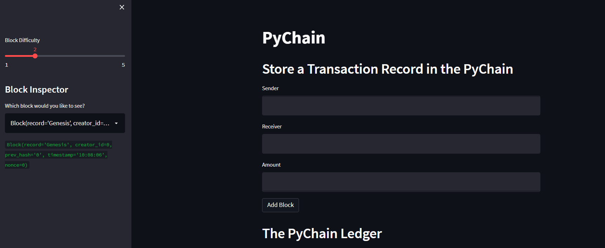
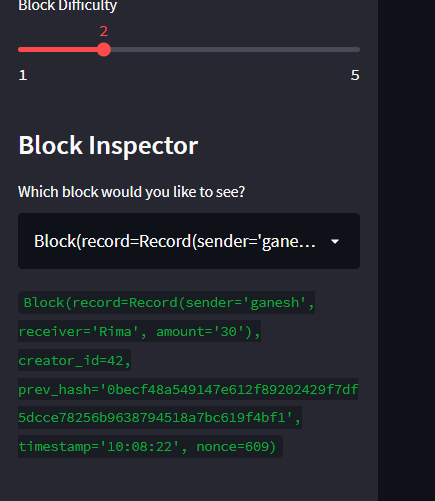
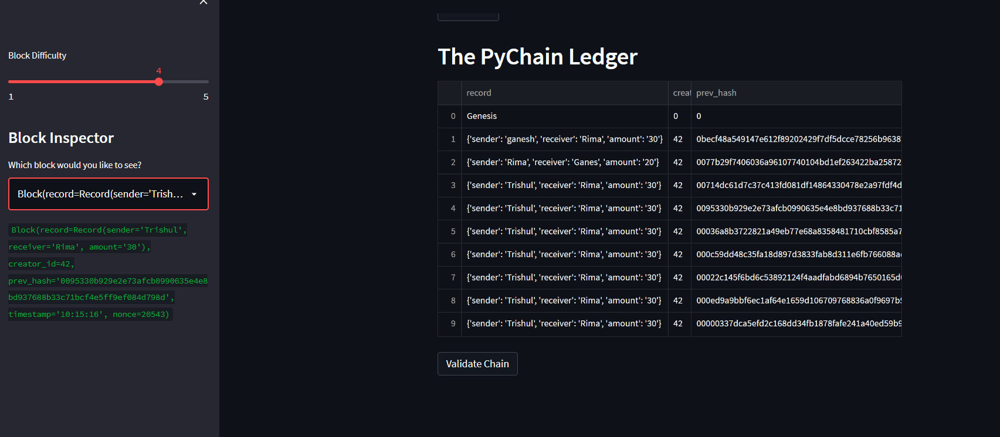

# PyChain Ledger

This app is a blockchain based ledger system. This ledger creates and records a blockchain entry based on user input and basiclaly perform a financial transaction using python.

# Landing Page
The landing page as it appears on webview.

This app can create new data classes based on a user input via streamlit interface  and record them by modifying existing Block Data Class. 

# Blockchian Validation
This app can also test and validate integrity. See screenshot below for the blockchain validation. 

# PYchain Ledger Entries

